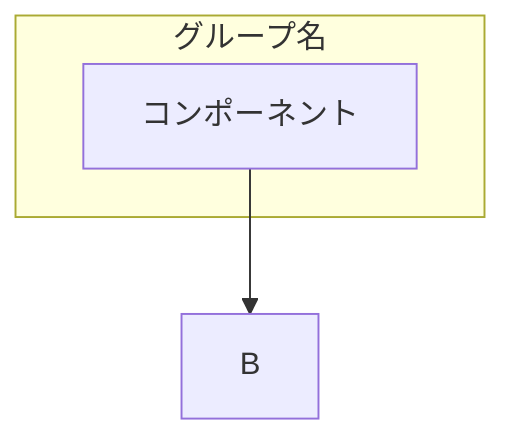
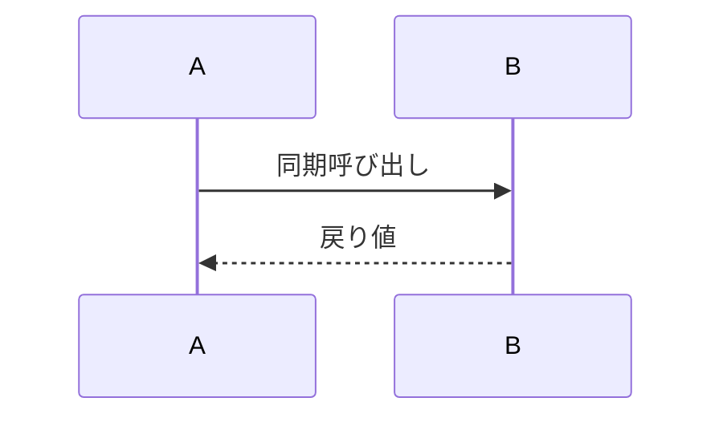

# Functional Design Guide

機能設計書を作成する際の詳細ガイド。

## 目的

PRD（何を作るか）を設計（どう実現するか）に変換する。

**良い機能設計書とは**:
- 開発者が「実装できる」レベルまで具体化されている
- PRDの各要件がどこで実現されるか追跡できる
- エッジケース・エラーパターンが網羅されている

## 必須アウトプット

### 1. システム構成図
- **形式**: Mermaid `graph TB`
- **粒度**: 3層（UI / Service / Data）から開始
- **必須要素**: ユーザー起点、主要コンポーネント名、データストア

### 2. データモデル
- **形式**: TypeScript interface
- **必須要素**:
  - 全フィールドの型
  - nullable の明示（`| null` または `?`）
  - 制約コメント（最大文字数、形式、デフォルト値）
  - PK/FK の明示

### 3. コンポーネント設計
- 責務（何をするか、何をしないか）
- 公開インターフェース（メソッドシグネチャ）
- 依存関係
- 対応PRDの明記

### 4. ユースケースフロー
- **形式**: Mermaid `sequenceDiagram`
- 主要アクターとコンポーネント
- 正常系フロー
- 代表的なエラーパス

### 5. エラーハンドリング
- **形式**: 表（エラー種別 / 処理 / ユーザー表示）
- カバー範囲: 認証・バリデーション・データ整合性・外部システム

## レビューチェックリスト

### PRDカバレッジ
- [ ] P0機能がすべて設計に含まれている
- [ ] 各設計セクションに「対応PRD」が明記されている
- [ ] 受け入れ条件がユースケースフローでカバーされている

### データモデル
- [ ] 全フィールドに型が定義されている
- [ ] nullable / optional が明示されている
- [ ] 制約がコメントされている
- [ ] PK / FK が明示されている

### フロー
- [ ] 正常系が網羅されている
- [ ] 主要なエラーパスが描かれている
- [ ] participant名が抽象的すぎない（実コンポーネント名を使用）

## Mermaid記法リファレンス

### システム構成図

### ER図

### シーケンス図

