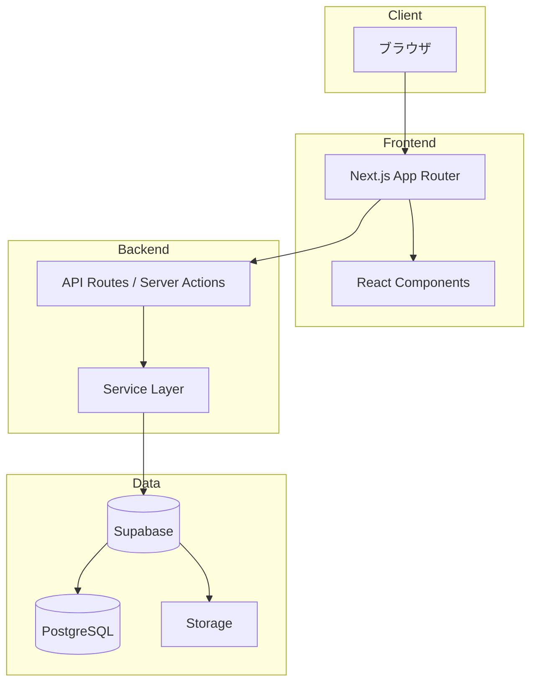
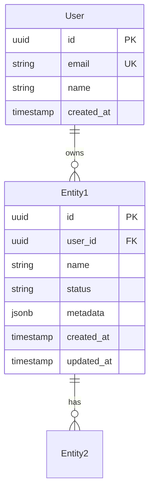
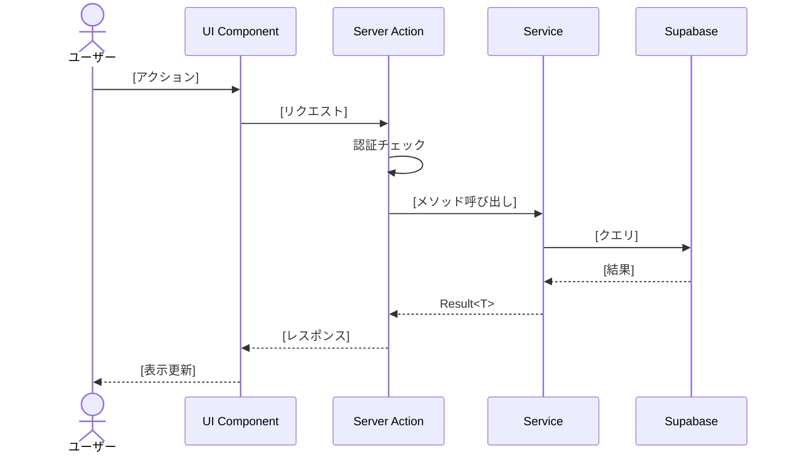

# 機能設計書 (Functional Design Document)

> **対応PRD**: `docs/product-requirements.md`
> **最終更新**: YYYY-MM-DD
> **ステータス**: Draft / Review / Approved

---

## 1. システム構成図



---

## 2. データモデル定義

### 2.1 エンティティ一覧

| エンティティ | 説明 | 対応PRD機能 |
|-------------|------|-------------|
| User | ユーザー情報 | 認証 |
| [Entity1] | [説明] | PRD: [機能名] |
| [Entity2] | [説明] | PRD: [機能名] |

### 2.2 [Entity1]

```typescript
interface Entity1 {
  id: string;                    // UUID, PK
  userId: string;                // FK -> User.id
  name: string;                  // 必須, 1-100文字
  description: string | null;    // 任意, 最大1000文字
  status: 'draft' | 'active' | 'archived';  // 必須
  metadata: Record<string, unknown>;  // JSONB
  createdAt: Date;               // 自動設定
  updatedAt: Date;               // 自動更新
}
```

**制約**:
- `name` は空文字不可
- `status` のデフォルトは `'draft'`
- `userId` は削除時 CASCADE

### 2.3 ER図



---

## 3. コンポーネント設計

### 3.1 レイヤー構成

| レイヤー | 責務 | 主要コンポーネント |
|---------|------|-------------------|
| UI | 表示・ユーザー入力 | Pages, Components |
| API | リクエスト処理・認証 | Route Handlers, Server Actions |
| Service | ビジネスロジック | [Domain]Service |
| Repository | データアクセス | Supabase Client |

### 3.2 [機能名]Service（PRD: [対応機能]）

**責務**:
- [責務1]
- [責務2]

**インターフェース**:
```typescript
interface I[Feature]Service {
  create(input: CreateInput): Promise<Result<Entity1>>;
  getById(id: string): Promise<Result<Entity1 | null>>;
  update(id: string, input: UpdateInput): Promise<Result<Entity1>>;
  delete(id: string): Promise<Result<void>>;
  list(filter: FilterInput): Promise<Result<Entity1[]>>;
}
```

---

## 4. ユースケースフロー

### 4.1 [ユースケース名]（PRD: [対応機能]）



---

## 5. エラーハンドリング

| カテゴリ | エラー種別 | 処理 | ユーザー表示 |
|---------|-----------|------|-------------|
| 認証 | 未ログイン | ログインへリダイレクト | - |
| 認証 | セッション期限切れ | 再ログイン要求 | 「セッションが切れました」 |
| バリデーション | 必須項目不足 | フォームにエラー表示 | 「[項目]は必須です」 |
| データ | 存在しない | 404ページ表示 | 「データが見つかりません」 |
| システム | DB接続エラー | リトライ後エラー画面 | 「一時的なエラーです」 |

---

## 6. セキュリティ考慮事項

| 観点 | 対策 |
|------|------|
| 認証 | Supabase Auth (JWT) |
| 認可 | RLS (Row Level Security) |
| 入力検証 | Zod スキーマバリデーション |
| XSS | React の自動エスケープ |

---

## 変更履歴

| 日付 | 変更内容 | 対応PRD変更 |
|------|---------|------------|
| YYYY-MM-DD | 初版作成 | - |
