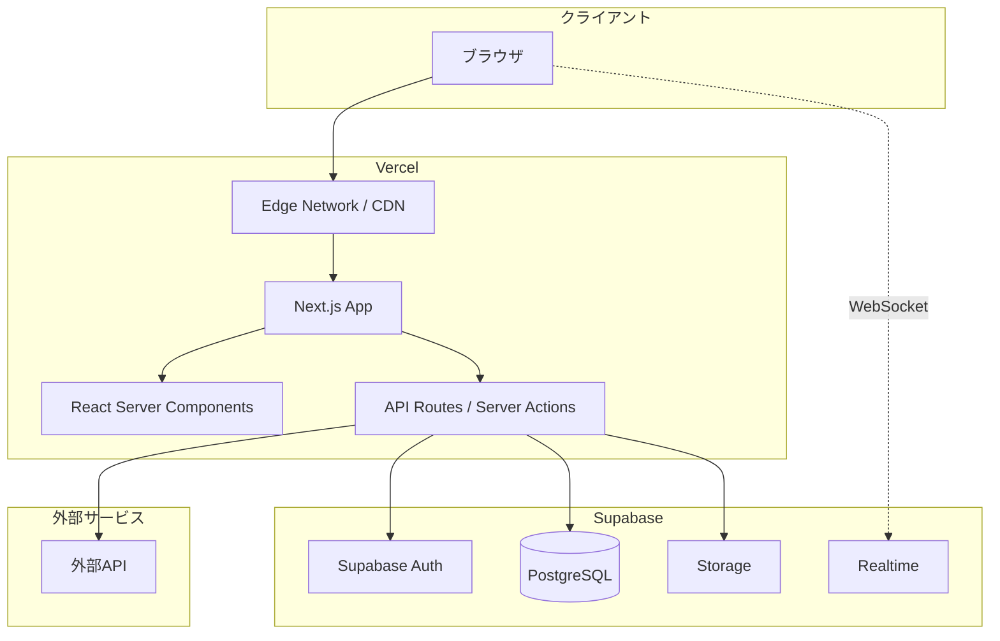

# アーキテクチャ設計書 (Architecture Design Document)

> **対応PRD**: `docs/product-requirements.md`  
> **対応機能設計**: `docs/functional-design.md`  
> **最終更新**: YYYY-MM-DD  
> **ステータス**: Draft / Review / Approved

---

## 1. 技術スタック

### 1.1 言語・ランタイム

| 技術 | バージョン | 用途 | 選定理由 |
|------|-----------|------|----------|
| TypeScript | 5.x | 全体 | 型安全性、IDE支援、チーム習熟度 |
| Node.js | 22.x LTS | ランタイム | LTS安定性、エコシステム |

### 1.2 フレームワーク

| 技術 | バージョン | 用途 | 選定理由 |
|------|-----------|------|----------|
| Next.js | 15.x | フロントエンド + API | App Router、RSC、Vercel連携 |
| React | 19.x | UI | Next.js標準、エコシステム |

### 1.3 データベース・ストレージ

| 技術 | 用途 | 選定理由 |
|------|------|----------|
| Supabase | BaaS | PostgreSQL + Auth + Storage + Realtime 統合 |
| PostgreSQL | RDB | Supabase標準、拡張性 |

### 1.4 インフラ・デプロイ

| 技術 | 用途 | 選定理由 |
|------|------|----------|
| Vercel | ホスティング | Next.js最適化、Preview環境 |
| Supabase Cloud | DBホスティング | マネージド、自動バックアップ |

### 1.5 開発ツール

| 技術 | 用途 | 選定理由 |
|------|------|----------|
| pnpm | パッケージ管理 | 高速、ディスク効率 |
| Biome | Lint + Format | 高速、設定簡素 |
| Vitest | テスト | Vite互換、高速 |
| Playwright | E2Eテスト | クロスブラウザ、安定性 |

---

## 2. システム構成図



---

## 3. レイヤー設計

### 3.1 レイヤー構成

```
┌─────────────────────────────────────────────┐
│  UI Layer (React Components)                │
│  - ページ・コンポーネント                      │
│  - 状態管理（React hooks）                    │
├─────────────────────────────────────────────┤
│  API Layer (Server Actions / Route Handlers)│
│  - 認証チェック                              │
│  - 入力バリデーション                         │
│  - レスポンス整形                            │
├─────────────────────────────────────────────┤
│  Service Layer                              │
│  - ビジネスロジック                           │
│  - トランザクション制御                        │
├─────────────────────────────────────────────┤
│  Repository Layer                           │
│  - データアクセス抽象化                        │
│  - Supabase Client操作                       │
└─────────────────────────────────────────────┘
```

### 3.2 依存ルール

| From | To | 許可 |
|------|-----|------|
| UI | API | ✅ |
| UI | Service | ❌（APIを経由） |
| API | Service | ✅ |
| Service | Repository | ✅ |
| Repository | Supabase | ✅ |
| 下位 → 上位 | - | ❌（循環禁止） |

---

## 4. データ戦略

### 4.1 データベース設計方針

| 方針 | 内容 |
|------|------|
| 正規化 | 3NF を基本、パフォーマンス要件で非正規化検討 |
| UUID | 主キーは UUID v7（時系列ソート可能） |
| ソフトデリート | `deleted_at` カラムで論理削除 |
| 監査カラム | `created_at`, `updated_at`, `created_by` |

### 4.2 バックアップ戦略

| 項目 | 設定 |
|------|------|
| 自動バックアップ | Supabase標準（日次） |
| Point-in-Time Recovery | Pro プラン以上で有効化 |
| 手動エクスポート | 月次で pg_dump |
| 復旧手順 | [別途ドキュメント化] |

### 4.3 キャッシュ戦略

| 対象 | 方式 | TTL |
|------|------|-----|
| 静的アセット | Vercel Edge Cache | 1年 |
| API レスポンス | stale-while-revalidate | 60秒 |
| DB クエリ | React Query | 5分 |

---

## 5. セキュリティ設計

### 5.1 認証

| 項目 | 実装 |
|------|------|
| 認証方式 | Supabase Auth (JWT) |
| セッション管理 | HTTP-only Cookie |
| トークン有効期限 | Access: 1時間 / Refresh: 7日 |

### 5.2 認可

| 項目 | 実装 |
|------|------|
| データアクセス制御 | RLS (Row Level Security) |
| API認可 | Server Action内でセッション検証 |
| 権限モデル | [RBAC / ABAC / なし] |

### 5.3 データ保護

| 項目 | 対策 |
|------|------|
| 通信暗号化 | TLS 1.3 |
| 保存時暗号化 | Supabase標準（AES-256） |
| 機密情報 | 環境変数（Vercel/Supabase Secrets） |
| PII | [マスキング/匿名化方針] |

### 5.4 入力検証

| 項目 | 実装 |
|------|------|
| スキーマバリデーション | Zod |
| SQLインジェクション | Supabase クエリビルダー（パラメータ化） |
| XSS | React自動エスケープ + DOMPurify（必要時） |

---

## 6. パフォーマンス設計

### 6.1 目標値（PRD連携）

| 指標 | 目標 | 測定方法 |
|------|------|----------|
| LCP (Largest Contentful Paint) | < 2.5秒 | Lighthouse |
| FID (First Input Delay) | < 100ms | Web Vitals |
| API レスポンス | < 500ms (p95) | Vercel Analytics |
| DB クエリ | < 100ms (p95) | Supabase Dashboard |

### 6.2 最適化方針

| 領域 | 施策 |
|------|------|
| フロントエンド | RSC活用、Code Splitting、画像最適化 |
| API | Edge Functions、ストリーミング |
| DB | インデックス設計、クエリ最適化 |
| ネットワーク | CDN、gzip/brotli |

---

## 7. スケーラビリティ設計

### 7.1 想定負荷

| 指標 | MVP | 6ヶ月後 | 1年後 |
|------|-----|---------|-------|
| DAU | 100 | 1,000 | 10,000 |
| 同時接続 | 10 | 100 | 1,000 |
| データ量 | 1GB | 10GB | 100GB |

### 7.2 スケール戦略

| フェーズ | 戦略 |
|---------|------|
| MVP | Vercel Hobby + Supabase Free |
| Growth | Vercel Pro + Supabase Pro |
| Scale | Vercel Enterprise + Supabase Team + Read Replica |

---

## 8. 依存関係管理

### 8.1 バージョン管理方針

| 種別 | 方針 |
|------|------|
| dependencies | `^`（マイナーバージョン追従） |
| devDependencies | `^`（マイナーバージョン追従） |
| ランタイム | メジャーバージョン固定 |

### 8.2 更新サイクル

| 頻度 | 対象 |
|------|------|
| 週次 | セキュリティパッチ |
| 月次 | マイナーバージョン |
| 四半期 | メジャーバージョン（影響評価後） |

---

## 9. テスト戦略

### 9.1 テストピラミッド

| 種別 | 対象 | ツール | カバレッジ目標 |
|------|------|--------|---------------|
| Unit | Service / Utils | Vitest | 80% |
| Integration | API + DB | Vitest + Testcontainers | 主要パス |
| E2E | ユーザーフロー | Playwright | クリティカルパス |

### 9.2 CI/CD 連携

| ステージ | 実行テスト |
|---------|-----------|
| PR | Unit + Integration |
| main マージ | Unit + Integration + E2E |
| デプロイ前 | Smoke Test |

---

## 10. 技術的制約

### 10.1 環境要件

| 項目 | 要件 |
|------|------|
| ブラウザ | Chrome/Edge/Safari/Firefox 最新2バージョン |
| Node.js | 22.x LTS |
| OS | 制限なし（Webアプリのため） |

### 10.2 外部サービス制約

| サービス | 制約 |
|---------|------|
| Vercel | Hobby: 帯域100GB/月 |
| Supabase | Free: DB 500MB, Storage 1GB |

---

## 変更履歴

| 日付 | 変更内容 | 対応PRD/設計変更 |
|------|---------|-----------------|
| YYYY-MM-DD | 初版作成 | - |
