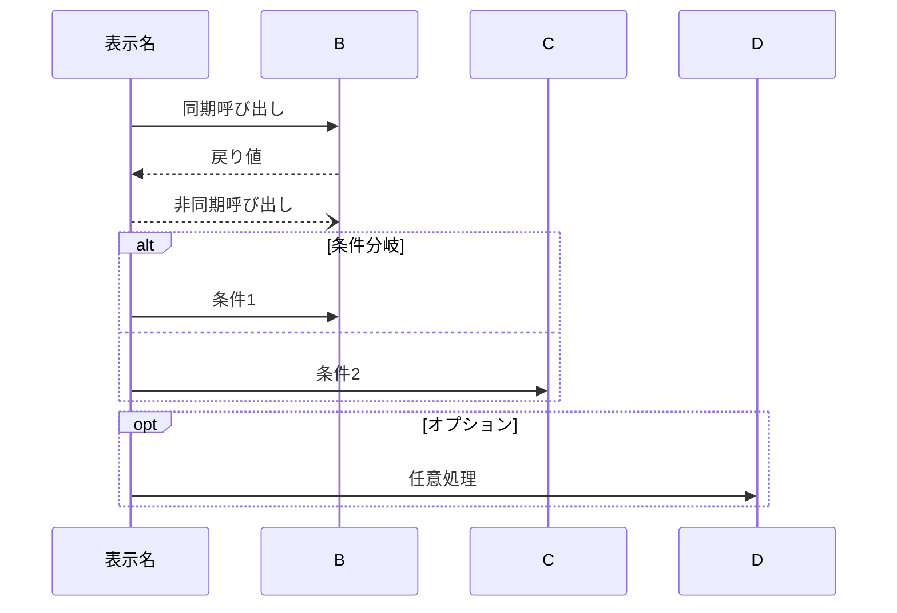
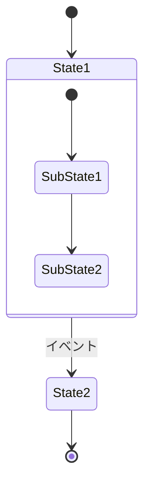

# Functional Design Reference

機能設計書を作成する際の詳細ガイド。

## 目次
1. [目的](#目的)
2. [スコープ](#スコープ)
3. [必須アウトプット](#必須アウトプット)
4. [設計の進め方](#設計の進め方)
5. [レビューチェックリスト](#レビューチェックリスト)
6. [よくある問題と対策](#よくある問題と対策)
7. [Mermaid記法リファレンス](#mermaid記法リファレンス)

---

## 目的

PRD（何を作るか）を設計（どう実現するか）に変換する。

**良い機能設計書とは**:
- 開発者が「実装できる」レベルまで具体化されている
- PRDの各要件がどこで実現されるか追跡できる
- エッジケース・エラーパターンが網羅されている

---

## スコープ

### 優先順位
1. **P0（MVP）機能** → 必ず設計
2. **P1機能** → MVPに影響する部分のみ設計
3. **P2以降** → 設計しない（後続イテレーションで）

### 設計の深さ

| 項目 | P0機能 | P1機能 |
|------|--------|--------|
| データモデル | 詳細（型・制約） | 概要のみ |
| コンポーネント | インターフェース定義 | 責務のみ |
| ユースケースフロー | シーケンス図 | 箇条書き |
| エラーハンドリング | 全パターン | 主要のみ |

---

## 必須アウトプット

### 1. システム構成図
- **形式**: Mermaid `graph TB`
- **粒度**: 3層（UI / Service / Data）から開始
- **必須要素**: 
  - ユーザー起点
  - 主要コンポーネント名（抽象的な「Service」ではなく「DiagnosisService」など）
  - データストア

### 2. データモデル
- **形式**: TypeScript interface
- **必須要素**:
  - 全フィールドの型
  - nullable の明示（`| null` または `?`）
  - 制約コメント（最大文字数、形式、デフォルト値）
  - PK/FK の明示
- **複数エンティティ時**: ER図（Mermaid `erDiagram`）を追加

### 3. コンポーネント設計
- **必須要素**:
  - 責務（何をするか、何をしないか）
  - 公開インターフェース（メソッドシグネチャ）
  - 依存関係
- **対応PRDの明記**: 見出しに `（PRD: 1. 診断）` のように記載

### 4. ユースケースフロー
- **形式**: Mermaid `sequenceDiagram`
- **必須要素**:
  - 主要アクターとコンポーネント
  - 正常系フロー
  - 代表的なエラーパス
- **PRDの受け入れ条件との対応付け**

### 5. エラーハンドリング
- **形式**: 表（エラー種別 / 処理 / ユーザー表示）
- **カバー範囲**:
  - 認証・認可エラー
  - バリデーションエラー
  - データ整合性エラー
  - 外部システムエラー

### 6. 条件付きアウトプット

| 条件 | 追加するもの |
|------|-------------|
| Web API がある | API設計（エンドポイント、リクエスト/レスポンス型） |
| UI がある | 画面遷移図（stateDiagram） |
| 複雑なロジックがある | アルゴリズム設計（計算式、実装例） |
| スコアリング/推薦がある | 重み・閾値の定義 |

---

## 設計の進め方

### Step 1: PRD分解
```
PRDを読み、以下を抽出：
├── P0機能リスト
│   ├── 機能1: 受け入れ条件 × N
│   └── 機能2: 受け入れ条件 × N
├── ペルソナのワークフロー
├── KPI（設計制約になるもの）
└── 非機能要件
```

### Step 2: エンティティ抽出
PRDから名詞を抽出し、データエンティティ候補を特定：
- ユーザーストーリーの主語・目的語
- 受け入れ条件に登場する概念

### Step 3: フロー設計
PRDの受け入れ条件ごとにフローを描く：
- 1つの受け入れ条件 = 1つのユースケース（目安）

### Step 4: エラー設計
各フローで「何が失敗しうるか」を洗い出す：
- 入力段階（バリデーション）
- 処理段階（ビジネスルール違反）
- データ段階（存在しない、権限なし）
- システム段階（外部API、DB）

---

## レビューチェックリスト

### PRDカバレッジ
- [ ] P0機能がすべて設計に含まれている
- [ ] 各設計セクションに「対応PRD」が明記されている
- [ ] 受け入れ条件がユースケースフローでカバーされている

### データモデル
- [ ] 全フィールドに型が定義されている
- [ ] nullable / optional が明示されている
- [ ] 制約（文字数、形式、デフォルト）がコメントされている
- [ ] PK / FK / UK が明示されている
- [ ] ER図のリレーションが正しい

### コンポーネント
- [ ] 責務が明確（1コンポーネント1責務）
- [ ] インターフェースが具体的（引数・戻り値の型）
- [ ] 依存関係が循環していない

### フロー
- [ ] 正常系が網羅されている
- [ ] 主要なエラーパスが描かれている
- [ ] participant名が抽象的すぎない

### エラーハンドリング
- [ ] 認証エラーがカバーされている
- [ ] バリデーションエラーがカバーされている
- [ ] ユーザー向けメッセージが具体的

---

## よくある問題と対策

| 問題 | 原因 | 対策 |
|------|------|------|
| PRDとの対応が不明 | 見出しに対応を書いていない | `（PRD: 1. 診断）` を必ず追記 |
| データモデルが曖昧 | 型だけで制約がない | コメントで制約を明記 |
| Mermaidが抽象的 | 「Service」「Component」のまま | 実名（DiagnosisService）を使う |
| エラーが漏れる | 正常系だけ考えた | Step 4 で系統的に洗い出す |
| 設計が過剰 | P0以外も詳細化 | スコープを厳守 |

---

## Mermaid記法リファレンス

### システム構成図
```mermaid
graph TB
    subgraph GroupName[グループ名]
        A[コンポーネント]
    end
    A --> B
    B -.-> C  %% 点線
```

### ER図
```mermaid
erDiagram
    Parent ||--o{ Child : has      %% 1対多
    Parent ||--|| Child : is       %% 1対1
    Parent }|--|| Child : belongs  %% 多対1
```

### シーケンス図


### 状態遷移図

