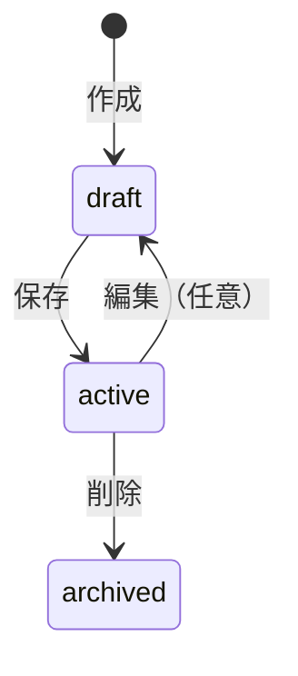

# プロジェクト用語集 (Glossary)

> **最終更新**: YYYY-MM-DD  
> **対応ドキュメント**: PRD / 機能設計 / アーキテクチャ

---

## 目次

1. [ドメイン用語](#1-ドメイン用語)
2. [技術用語](#2-技術用語)
3. [アーキテクチャ用語](#3-アーキテクチャ用語)
4. [ステータス・状態](#4-ステータス状態)
5. [略語・頭字語](#5-略語頭字語)

---

## 1. ドメイン用語

プロジェクト固有のビジネス概念・機能に関する用語。

### [用語名]

| 項目 | 内容 |
|------|------|
| **定義** | [明確で一意な定義] |
| **説明** | [補足説明・背景] |
| **関連用語** | [関連用語1](#関連用語1), [関連用語2](#関連用語2) |
| **使用例** | ユーザーが[用語]を実行すると、[結果]が得られる |
| **対応PRD** | PRD: [機能名] |

---

### 診断（Diagnosis）

| 項目 | 内容 |
|------|------|
| **定義** | ユーザーの会社属性・課題・制約を入力し、SaaS推薦の基礎データを生成するプロセス |
| **説明** | 本プロダクトの入り口となる機能。入力された情報は推薦アルゴリズムの入力となる |
| **関連用語** | [推薦](#推薦recommendation), [Must条件](#must条件) |
| **使用例** | 診断を完了すると、候補SaaSの一覧が表示される |
| **対応PRD** | PRD: 1. 診断（要件入力） |

---

### [用語名2]

| 項目 | 内容 |
|------|------|
| **定義** | |
| **説明** | |
| **関連用語** | |
| **使用例** | |
| **対応PRD** | |

---

## 2. 技術用語

プロジェクトで使用している技術・フレームワーク・ツールに関する用語。

### [技術名]

| 項目 | 内容 |
|------|------|
| **定義** | [技術の簡潔な説明] |
| **公式サイト** | [URL] |
| **本プロジェクトでの用途** | [どのように使用しているか] |
| **バージョン** | [使用バージョン] |
| **実装箇所** | `src/lib/[技術]/` |
| **関連ドキュメント** | [docs/architecture.md](architecture.md) |

---

### Supabase

| 項目 | 内容 |
|------|------|
| **定義** | PostgreSQL をベースとした BaaS（Backend as a Service） |
| **公式サイト** | https://supabase.com |
| **本プロジェクトでの用途** | 認証（Auth）、データベース（PostgreSQL）、ストレージ |
| **バージョン** | Supabase JS v2.x |
| **実装箇所** | `src/lib/supabase/` |
| **関連ドキュメント** | [docs/architecture.md](architecture.md) |

---

### RLS（Row Level Security）

| 項目 | 内容 |
|------|------|
| **定義** | PostgreSQL の行レベルセキュリティ機能。テーブルの各行へのアクセスをポリシーで制御 |
| **本プロジェクトでの用途** | ユーザーが自分のデータのみアクセスできるよう制御 |
| **実装箇所** | Supabase Dashboard / マイグレーション |
| **関連用語** | [Supabase](#supabase) |

---

## 3. アーキテクチャ用語

システム設計・構成に関する用語。

### [概念名]

| 項目 | 内容 |
|------|------|
| **定義** | [アーキテクチャ概念の説明] |
| **本プロジェクトでの適用** | [どのように実装されているか] |
| **関連コンポーネント** | [コンポーネント名] |
| **関連用語** | |
| **参照** | [docs/architecture.md](architecture.md) |

---

### Service Layer

| 項目 | 内容 |
|------|------|
| **定義** | ビジネスロジックを実装するレイヤー。UIに依存せず、Repositoryを通じてデータアクセス |
| **本プロジェクトでの適用** | `src/services/` 配下に配置。各ドメインごとにServiceクラス/関数を作成 |
| **関連コンポーネント** | DiagnosisService, RecommendationService |
| **関連用語** | [Repository Layer](#repository-layer) |
| **参照** | [docs/architecture.md](architecture.md), [docs/repository-structure.md](repository-structure.md) |

---

## 4. ステータス・状態

システム内で使用される状態値の定義。

### [エンティティ]のステータス

| ステータス | 値 | 意味 | 遷移条件 | 次の状態 |
|----------|-----|------|---------|---------|
| 下書き | `draft` | 作成中、未完了 | 作成直後 | `active` |
| 有効 | `active` | 利用可能な状態 | 保存完了時 | `archived` |
| アーカイブ | `archived` | 論理削除済み | ユーザーが削除実行 | - |

**状態遷移図**:

**実装箇所**: `src/types/[entity].ts`, `[entity]` テーブル `status` カラム

---

## 5. 略語・頭字語

### PRD

| 項目 | 内容 |
|------|------|
| **正式名称** | Product Requirements Document |
| **日本語** | プロダクト要求定義書 |
| **意味** | 何を作るかを定義したドキュメント |
| **本プロジェクトでの使用** | `docs/product-requirements.md` |

---

### KPI

| 項目 | 内容 |
|------|------|
| **正式名称** | Key Performance Indicator |
| **日本語** | 重要業績評価指標 |
| **意味** | プロダクトの成功を測る指標 |
| **本プロジェクトでの使用** | PRD「成功指標」セクションで定義 |

---

### DAU

| 項目 | 内容 |
|------|------|
| **正式名称** | Daily Active Users |
| **日本語** | 日次アクティブユーザー数 |
| **意味** | 1日にサービスを利用したユニークユーザー数 |
| **測定方法** | Supabase Auth ログイン数 |

---

### MVP

| 項目 | 内容 |
|------|------|
| **正式名称** | Minimum Viable Product |
| **日本語** | 最小限の実用可能なプロダクト |
| **意味** | 価値検証に必要な最小限の機能セット |
| **本プロジェクトでの使用** | PRD「コア機能（MVP）」= P0機能 |

---

## 変更履歴

| 日付 | 変更内容 | 変更者 |
|------|---------|--------|
| YYYY-MM-DD | 初版作成 | - |
