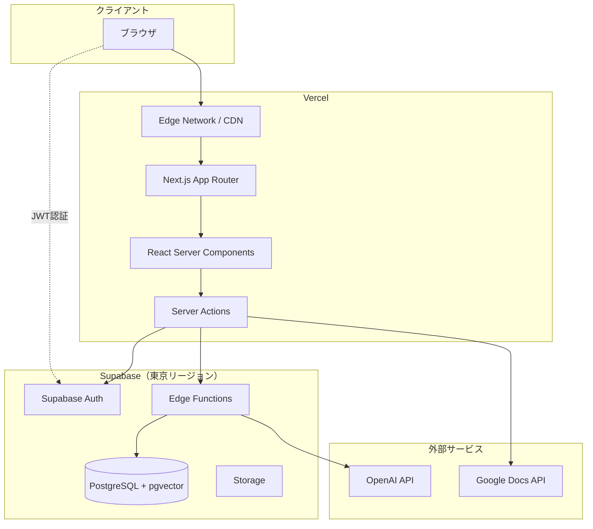
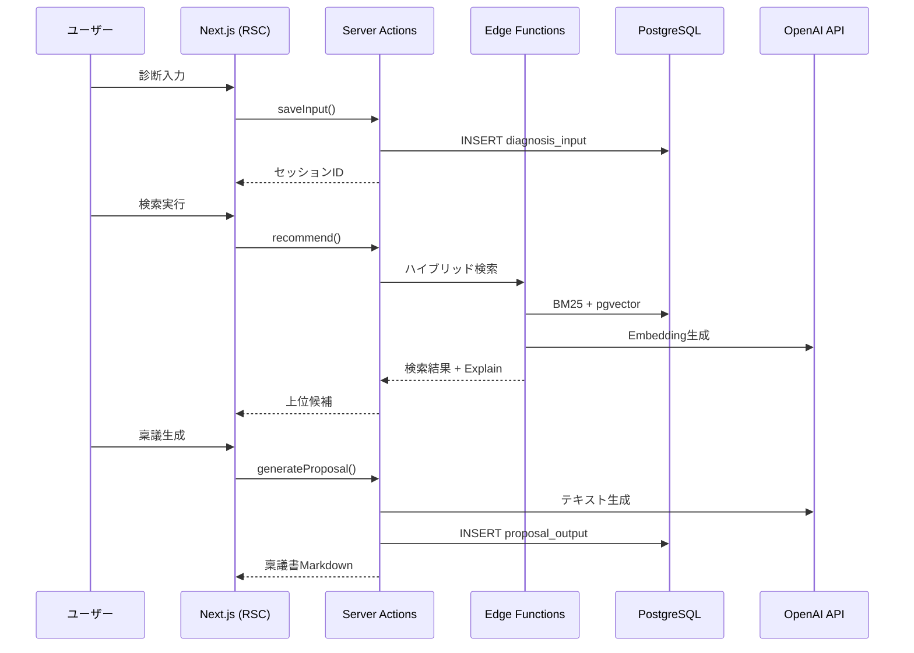

# アーキテクチャ設計書 (Architecture Design Document)

> **対応PRD**: `docs/product-requirements.md`  
> **対応機能設計**: `docs/functional-design.md`  
> **最終更新**: 2025-01-11  
> **ステータス**: Draft

---

## 1. 技術スタック

### 1.1 言語・ランタイム

| 技術 | バージョン | 用途 | 選定理由 |
|------|-----------|------|----------|
| TypeScript | 5.x | 全体 | 型安全性、IDE支援、Supabase型生成との親和性 |
| Node.js | 22.x LTS | ランタイム | LTS安定性、Next.js推奨バージョン |

### 1.2 フレームワーク

| 技術 | バージョン | 用途 | 選定理由 |
|------|-----------|------|----------|
| Next.js | 15.x | フロントエンド + API | App Router、RSC、Vercel最適化 |
| React | 19.x | UI | Next.js標準、Server Components対応 |

### 1.3 データベース・ストレージ

| 技術 | 用途 | 選定理由 |
|------|------|----------|
| Supabase | BaaS | PostgreSQL + Auth + Storage + Edge Functions 統合、日本リージョン対応 |
| PostgreSQL | RDB | Supabase標準、拡張性（pgvector対応） |
| pgvector | ベクトル検索 | OpenAI Embeddings連携、ハイブリッド検索実現 |

### 1.4 インフラ・デプロイ

| 技術 | 用途 | 選定理由 |
|------|------|----------|
| Vercel | ホスティング | Next.js最適化、Preview環境、Edge Network |
| Supabase Cloud | DBホスティング | マネージド、自動バックアップ、東京リージョン |

### 1.5 外部サービス

| 技術 | 用途 | 選定理由 |
|------|------|----------|
| OpenAI API | Embedding生成、稟議テキスト生成 | 高精度、日本語対応、実績 |
| Google Docs API | 稟議書出力 | ユーザー要件（OAuth連携） |

### 1.6 開発ツール

| 技術 | 用途 | 選定理由 |
|------|------|----------|
| pnpm | パッケージ管理 | 高速、ディスク効率、ワークスペース対応 |
| Biome | Lint + Format | 高速、設定簡素、ESLint/Prettier代替 |
| Vitest | テスト | Vite互換、TypeScript対応、高速 |
| Playwright | E2Eテスト | クロスブラウザ、安定性、Vercel連携 |

---

## 2. システム構成図



### 2.1 データフロー（診断→稟議生成）



---

## 3. レイヤー設計

### 3.1 レイヤー構成

```
┌─────────────────────────────────────────────────────────────┐
│  UI Layer (React Server/Client Components)                 │
│  - app/診断/page.tsx, app/比較/page.tsx, etc.              │
│  - components/ (共通UIコンポーネント)                        │
│  - Shadcn/ui + TailwindCSS                                 │
├─────────────────────────────────────────────────────────────┤
│  API Layer (Server Actions)                                │
│  - app/actions/ (診断, 検索, 稟議生成)                       │
│  - 認証チェック (getSession)                                │
│  - Zodバリデーション                                        │
├─────────────────────────────────────────────────────────────┤
│  Service Layer                                             │
│  - src/services/ (DiagnosisService, SearchService, etc.)   │
│  - ビジネスロジック                                         │
│  - トランザクション制御                                      │
├─────────────────────────────────────────────────────────────┤
│  Repository Layer                                          │
│  - src/repositories/                                       │
│  - Supabase Client操作                                     │
│  - 型安全なクエリビルダー                                    │
├─────────────────────────────────────────────────────────────┤
│  Infrastructure Layer                                      │
│  - src/lib/ (supabase client, openai client)              │
│  - Supabase Edge Functions (重い処理用)                    │
└─────────────────────────────────────────────────────────────┘
```

### 3.2 依存ルール

| From | To | 許可 | 理由 |
|------|-----|------|------|
| UI | Server Actions | ✅ | フォームアクション |
| UI | Service | ❌ | Server Actions経由で呼び出し |
| Server Actions | Service | ✅ | ビジネスロジック委譲 |
| Service | Repository | ✅ | データアクセス |
| Repository | Supabase Client | ✅ | DB操作 |
| 下位 → 上位 | - | ❌ | 循環参照禁止 |

### 3.3 ディレクトリ構成（概要）

```
src/
├── app/                      # Next.js App Router
│   ├── (auth)/              # 認証ルート
│   ├── (dashboard)/         # メインアプリ
│   │   ├── diagnosis/       # 診断フロー
│   │   ├── search/          # 検索・推薦
│   │   ├── compare/         # 比較UI
│   │   └── proposal/        # 稟議生成
│   └── actions/             # Server Actions
├── components/              # 共通コンポーネント
├── services/                # ビジネスロジック
├── repositories/            # データアクセス
├── lib/                     # ユーティリティ
└── types/                   # 型定義
```

---

## 4. データ戦略

### 4.1 データベース設計方針

| 方針 | 内容 | 理由 |
|------|------|------|
| 正規化 | 3NF を基本 | データ整合性、更新異常防止 |
| UUID | 主キーは UUID v4 | Supabase標準、分散ID生成 |
| ソフトデリート | `deleted_at` カラム | 監査証跡、復元可能性 |
| 監査カラム | `created_at`, `updated_at` | トレーサビリティ |
| JSONB | 柔軟な構造（weights, explain等） | スキーマ進化への対応 |

### 4.2 バックアップ戦略

| 項目 | 設定 | 対象プラン |
|------|------|-----------|
| 自動バックアップ | 日次 | Free〜 |
| Point-in-Time Recovery | 7日間 | Pro〜 |
| 手動エクスポート | 週次で pg_dump | 全プラン |
| 復旧手順 | `docs/disaster-recovery.md` | - |

### 4.3 キャッシュ戦略

| 対象 | 方式 | TTL | 理由 |
|------|------|-----|------|
| 静的アセット | Vercel Edge Cache | 1年 | immutable |
| Solution マスタ | React Query | 1時間 | 低頻度更新 |
| 検索結果 | なし（都度取得） | - | パーソナライズ |
| 診断セッション | React Query | 5分 | 作業中更新あり |

### 4.4 インデックス設計

| テーブル | カラム | 種別 | 用途 |
|---------|-------|------|------|
| solution | category | B-tree | カテゴリフィルタ |
| solution | name | GIN (pg_trgm) | あいまい検索 |
| solution_chunk | embedding | IVFFlat | ベクトル近傍検索 |
| solution_chunk | content | GIN (to_tsvector) | BM25全文検索 |
| diagnosis_session | tenant_id, created_at | B-tree | 履歴一覧 |

---

## 5. セキュリティ設計

### 5.1 認証

| 項目 | 実装 | PRD対応 |
|------|------|---------|
| 認証方式 | Supabase Auth (JWT) | 5. 認証 |
| プロバイダ | Email / Google / Microsoft | 5. 認証 |
| セッション管理 | HTTP-only Cookie | - |
| トークン有効期限 | Access: 1時間 / Refresh: 7日 | 24時間（PRD） |

### 5.2 認可（Row Level Security）

| テーブル | RLSポリシー |
|---------|-----------|
| tenant | `auth.uid() IN (SELECT user_id FROM tenant_member WHERE tenant_id = id)` |
| diagnosis_session | `tenant_id IN (ユーザー所属テナント)` |
| proposal_output | `session.tenant_id IN (ユーザー所属テナント)` |
| solution | 全員読み取り可 |

### 5.3 データ保護

| 項目 | 対策 | PRD対応 |
|------|------|---------|
| 通信暗号化 | TLS 1.3 | ✅ |
| 保存時暗号化 | Supabase標準（AES-256） | ✅ |
| 機密情報 | Vercel/Supabase Secrets | - |
| APIキー | サーバーサイドのみ（RSC/Server Actions） | - |

### 5.4 入力検証

| 項目 | 実装 |
|------|------|
| スキーマバリデーション | Zod（Server Actions入口） |
| SQLインジェクション | Supabase クエリビルダー（パラメータ化） |
| XSS | React自動エスケープ |
| CSRF | Server Actions組み込み保護 |

### 5.5 監査ログ

| 対象 | 保存先 | 保持期間 | PRD対応 |
|------|-------|---------|---------|
| 認証イベント | Supabase Auth Logs | 90日 | ✅ |
| API呼び出し | Vercel Logs + カスタムログテーブル | 90日 | ✅ |
| データ変更 | PostgreSQL Audit Trigger | 90日 | ✅ |

---

## 6. パフォーマンス設計

### 6.1 目標値（PRD連携）

| 指標 | 目標 | PRD要件 | 測定方法 |
|------|------|---------|----------|
| 診断→推薦表示 | < 3秒 | 3秒以内 | Vercel Analytics |
| 検索結果表示 | < 2秒 | 2秒以内（100件DB） | Vercel Analytics |
| 稟議生成 | < 5秒 | 5秒以内 | Vercel Analytics |
| LCP | < 2.5秒 | - | Lighthouse |
| FID | < 100ms | - | Web Vitals |

### 6.2 最適化方針

| 領域 | 施策 | 効果 |
|------|------|------|
| フロントエンド | RSC活用、Streaming、Suspense | TTFB短縮 |
| 検索 | pgvector IVFFlat、プロファイリング | クエリ高速化 |
| Embedding | バッチ生成、キャッシュ | API呼び出し削減 |
| 稟議生成 | ストリーミングレスポンス | 体感速度向上 |
| アセット | next/image、フォント最適化 | LCP改善 |

### 6.3 ボトルネック対策

| 処理 | 想定ボトルネック | 対策 |
|------|----------------|------|
| ベクトル検索 | pgvector IVFFlat構築 | 事前インデックス、nprobe調整 |
| OpenAI呼び出し | レイテンシ変動 | ストリーミング、タイムアウト設定 |
| Google Docs出力 | API制限 | 非同期生成、ポーリング |

---

## 7. スケーラビリティ設計

### 7.1 想定負荷（PRD連携）

| 指標 | MVP | 6ヶ月後 | 1年後 |
|------|-----|---------|-------|
| DAU | 100 | 500 | 1,000 |
| 同時接続 | 10 | 50 | 100 |
| DB製品数 | 100 | 300 | 1,000 |
| 月間稟議生成数 | 500 | 2,500 | 10,000 |

### 7.2 スケール戦略

| フェーズ | インフラ | 月額目安 |
|---------|---------|---------|
| MVP | Vercel Hobby + Supabase Free | $0 |
| Growth | Vercel Pro + Supabase Pro | $45 |
| Scale | Vercel Pro + Supabase Pro + Read Replica | $100+ |

### 7.3 スケールアウト対応

| コンポーネント | スケール方法 |
|--------------|-------------|
| Next.js | Vercel自動スケール（Serverless） |
| PostgreSQL | Supabase Compute Add-on / Read Replica |
| Edge Functions | Supabase自動スケール |
| ベクトル検索 | pgvector → Pinecone/Qdrant移行検討（1000件超） |

---

## 8. 依存関係管理

### 8.1 主要依存パッケージ

| パッケージ | 用途 | バージョン方針 |
|-----------|------|---------------|
| next | フレームワーク | `^15.x` |
| @supabase/supabase-js | DB/Auth | `^2.x` |
| @supabase/ssr | SSR対応 | `^0.x` |
| openai | AI API | `^4.x` |
| zod | バリデーション | `^3.x` |
| @tanstack/react-query | データフェッチ | `^5.x` |

### 8.2 バージョン管理方針

| 種別 | 方針 |
|------|------|
| dependencies | `^`（マイナーバージョン追従） |
| devDependencies | `^`（マイナーバージョン追従） |
| ランタイム（Node.js） | `.nvmrc` で固定 |

### 8.3 更新サイクル

| 頻度 | 対象 | 責任者 |
|------|------|--------|
| 週次 | セキュリティパッチ（Dependabot） | 自動 |
| 月次 | マイナーバージョン | 開発チーム |
| 四半期 | メジャーバージョン（影響評価後） | リード |

---

## 9. テスト戦略

### 9.1 テストピラミッド

| 種別 | 対象 | ツール | カバレッジ目標 |
|------|------|--------|---------------|
| Unit | Services / Utils | Vitest | 80% |
| Integration | Server Actions + DB | Vitest + Supabase Local | 主要パス |
| E2E | ユーザーフロー | Playwright | クリティカルパス |

### 9.2 テスト対象優先度

| 機能 | Unit | Integration | E2E |
|------|------|-------------|-----|
| 診断入力バリデーション | ✅ | ✅ | - |
| ハイブリッド検索 | ✅ | ✅ | - |
| スコアリング計算 | ✅ | - | - |
| 稟議生成 | - | ✅ | ✅ |
| 認証フロー | - | ✅ | ✅ |
| 比較UI操作 | - | - | ✅ |

### 9.3 CI/CD連携

| ステージ | 実行テスト | 必須 |
|---------|-----------|------|
| PR | Unit + Integration | ✅ |
| main マージ | Unit + Integration + E2E | ✅ |
| Preview Deploy | Smoke Test | - |
| Production Deploy | Smoke Test | ✅ |

---

## 10. 技術的制約

### 10.1 環境要件

| 項目 | 要件 | 備考 |
|------|------|------|
| ブラウザ | Chrome/Edge/Safari/Firefox 最新2バージョン | PRD: モバイル対応 |
| Node.js | 22.x LTS | `.nvmrc` で管理 |
| OS | 制限なし（Webアプリ） | - |

### 10.2 外部サービス制約

| サービス | 制約 | 対策 |
|---------|------|------|
| Vercel Hobby | 帯域100GB/月 | Pro移行で緩和 |
| Supabase Free | DB 500MB, Storage 1GB | Pro移行で緩和 |
| OpenAI API | Rate Limit (TPM/RPM) | リトライ + バックオフ |
| Google Docs API | 300リクエスト/分 | キュー制御 |

### 10.3 運用制約

| 項目 | 制約 | 理由 |
|------|------|------|
| メンテナンスウィンドウ | 日曜深夜 2:00-4:00 JST | ユーザー影響最小化 |
| デプロイ禁止時間 | 金曜17:00以降 | 週末対応回避 |
| DB マイグレーション | Preview環境で検証必須 | データ損失防止 |

---

## 11. ADR（アーキテクチャ決定記録）

### ADR-001: BaaS選定（Supabase vs Firebase）

| 項目 | Supabase | Firebase |
|------|---------|---------|
| DB | PostgreSQL（SQL） | Firestore（NoSQL） |
| ベクトル検索 | pgvector対応 | 要Pinecone連携 |
| 日本リージョン | ✅（東京） | ✅ |
| 価格 | Free枠あり | Free枠あり |
| **決定** | ✅ Supabase | - |

**理由**: pgvectorによるハイブリッド検索が要件。SQLの柔軟性。型生成の親和性。

### ADR-002: 稟議生成のストリーミング

| 選択肢 | 採用 |
|-------|------|
| 同期生成（5秒待機） | ❌ |
| ストリーミングレスポンス | ✅ |

**理由**: PRD要件「5秒以内」を満たしつつ、体感速度を向上。部分表示で待機時間を軽減。

### ADR-003: Edge Functions vs Server Actions

| 処理 | 実装先 | 理由 |
|------|-------|------|
| 認証チェック | Server Actions | Next.js統合 |
| バリデーション | Server Actions | Zodとの親和性 |
| ハイブリッド検索 | Edge Functions | DB近接、複雑クエリ |
| Embedding生成 | Edge Functions | OpenAI呼び出し集約 |
| 稟議生成 | Server Actions | ストリーミング対応 |

---

## 変更履歴

| 日付 | 変更内容 | 対応PRD/設計変更 |
|------|---------|-----------------|
| 2025-01-11 | 初版作成 | PRD v1.0 対応 |

