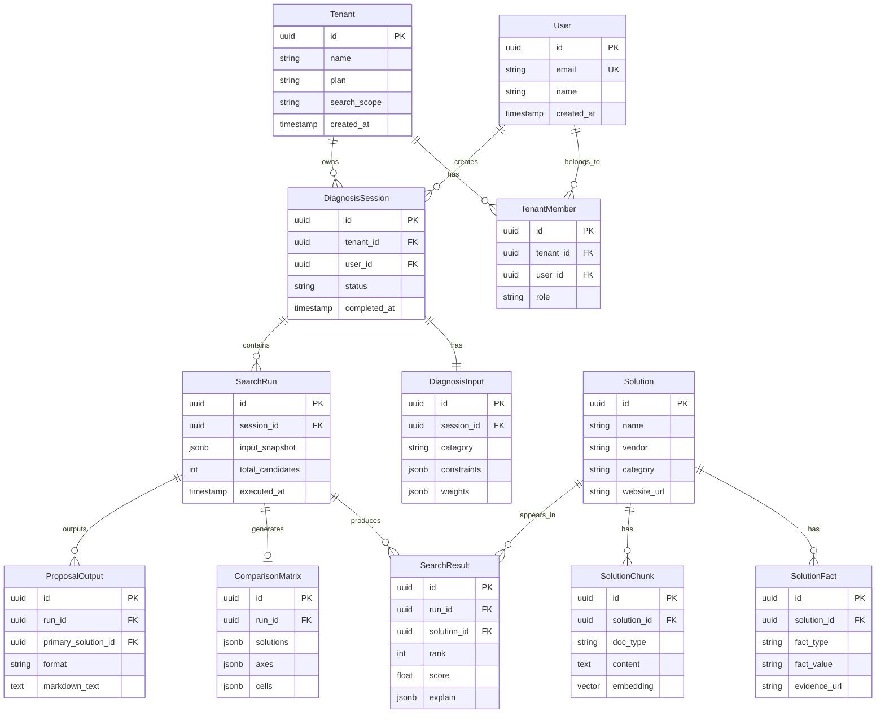

# 機能設計書 (Functional Design Document)

> **対応PRD**: `docs/product-requirements.md`  
> **最終更新**: 2026-01-11  
> **ステータス**: Draft

---

## 1. システム構成図


---

## 2. データモデル定義

### 2.1 エンティティ一覧

| エンティティ | 説明 | 対応PRD機能 |
|-------------|------|-------------|
| User | ユーザー情報 | 5. 認証・テナント管理 |
| Tenant | テナント（組織）情報 | 5. 認証・テナント管理 |
| TenantMember | テナントメンバー | 5. 認証・テナント管理 |
| DiagnosisSession | 診断セッション | 1. 診断 |
| DiagnosisInput | 診断入力データ | 1. 診断 |
| Solution | SaaS製品マスタ | 2. 検索・推薦 |
| SolutionFact | 製品ファクト情報 | 2. 検索・推薦 |
| SolutionChunk | 製品ドキュメントチャンク | 2. 検索・推薦 |
| SearchRun | 検索実行結果 | 2. 検索・推薦 |
| SearchResult | 検索結果詳細 | 2. 検索・推薦 |
| ComparisonMatrix | 比較マトリクス | 3. 比較UI |
| ProposalOutput | 稟議出力 | 4. 稟議1枚生成 |

### 2.2 User

```typescript
interface User {
  id: string;                    // UUID, PK (Supabase Auth連携)
  email: string;                 // 必須, UK, メールアドレス形式
  name: string | null;           // 任意, 最大100文字
  avatarUrl: string | null;      // 任意, URL形式
  createdAt: Date;               // 自動設定
  updatedAt: Date;               // 自動更新
}
```

### 2.3 Tenant

```typescript
interface Tenant {
  id: string;                    // UUID, PK
  name: string;                  // 必須, 1-100文字, 組織名
  plan: 'free' | 'business' | 'enterprise';  // デフォルト: 'free'
  searchScope: 'JP_ONLY' | 'JP_GLOBAL';      // デフォルト: 'JP_ONLY'
  ingestionMode: 'CURATED' | 'BROAD';        // デフォルト: 'CURATED'
  createdAt: Date;               // 自動設定
  updatedAt: Date;               // 自動更新
}
```

### 2.4 TenantMember

```typescript
interface TenantMember {
  id: string;                    // UUID, PK
  tenantId: string;              // FK -> Tenant.id, CASCADE
  userId: string;                // FK -> User.id, CASCADE
  role: 'owner' | 'admin' | 'member';  // デフォルト: 'member'
  createdAt: Date;               // 自動設定
}
```

### 2.5 DiagnosisSession

```typescript
interface DiagnosisSession {
  id: string;                    // UUID, PK
  tenantId: string;              // FK -> Tenant.id, CASCADE
  userId: string;                // FK -> User.id, CASCADE
  status: 'in_progress' | 'completed' | 'archived';  // デフォルト: 'in_progress'
  completedAt: Date | null;      // 完了時に設定
  createdAt: Date;               // 自動設定
  updatedAt: Date;               // 自動更新
}
```

### 2.6 DiagnosisInput

```typescript
interface DiagnosisInput {
  id: string;                    // UUID, PK
  sessionId: string;             // FK -> DiagnosisSession.id, CASCADE
  
  // 会社属性
  companyIndustry: string;       // 必須, 業種
  companySize: '1-50' | '51-100' | '101-300' | '301-1000' | '1001+';
  companyRegion: string;         // 地域
  
  // 対象カテゴリ
  category: 'accounting' | 'expense' | 'attendance' | 'hr' | 
            'workflow' | 'e_contract' | 'invoice' | 'procurement';
  
  // 課題
  problems: string[];            // 複数選択
  problemFreeText: string | null; // 自由記述, 最大1000文字
  
  // Must条件
  constraints: DiagnosisConstraints;
  
  // 重み付け
  weights: DiagnosisWeights;
  
  createdAt: Date;               // 自動設定
  updatedAt: Date;               // 自動更新
}

interface DiagnosisConstraints {
  budgetMax: number | null;      // 月額上限（円）
  deployDeadline: Date | null;   // 導入期限
  requiredLanguages: string[];   // 必要言語 ['ja', 'en']
  requireSso: boolean;           // SSO必須
  requireAuditLog: boolean;      // 監査ログ必須
  dataResidency: 'japan' | 'any' | null;  // データ保管地域
}

interface DiagnosisWeights {
  operationEase: number;         // 運用負荷 (0-10)
  deploymentEase: number;        // 導入難易度 (0-10)
  integrations: number;          // 連携 (0-10)
  security: number;              // セキュリティ (0-10)
  price: number;                 // 価格 (0-10)
}
```

### 2.7 Solution（SaaS製品マスタ）

```typescript
interface Solution {
  id: string;                    // UUID, PK
  name: string;                  // 必須, 製品名
  vendor: string;                // 必須, ベンダー名
  category: string;              // カテゴリ
  description: string;           // 製品概要
  websiteUrl: string;            // 公式サイトURL
  logoUrl: string | null;        // ロゴURL
  originCountry: string;         // 原産国 (e.g., 'JP')
  salesRegions: string[];        // 販売地域
  locales: string[];             // 対応言語
  isActive: boolean;             // 有効フラグ
  lastVerifiedAt: Date;          // 最終確認日
  createdAt: Date;               // 自動設定
  updatedAt: Date;               // 自動更新
}
```

### 2.8 SolutionFact

```typescript
interface SolutionFact {
  id: string;                    // UUID, PK
  solutionId: string;            // FK -> Solution.id, CASCADE
  factType: 'sso' | 'audit_log' | 'data_residency' | 'api' | 
            'mobile' | 'offline' | 'support' | 'compliance';
  factValue: string;             // 値（'supported', 'not_supported', 具体値）
  evidenceUrl: string | null;    // 根拠URL
  verifiedAt: Date;              // 確認日
  confidence: 'high' | 'medium' | 'low';  // 確信度
  createdAt: Date;               // 自動設定
  updatedAt: Date;               // 自動更新
}
```

### 2.9 SolutionChunk

```typescript
interface SolutionChunk {
  id: string;                    // UUID, PK
  solutionId: string;            // FK -> Solution.id, CASCADE
  docType: 'pricing' | 'features' | 'security' | 'integrations' | 'cases' | 'faq';
  content: string;               // チャンクテキスト
  embedding: number[];           // pgvector (1536次元)
  sourceUrl: string;             // 元URL
  contentHash: string;           // 差分検出用ハッシュ
  createdAt: Date;               // 自動設定
  updatedAt: Date;               // 自動更新
}
```

### 2.10 SearchRun

```typescript
interface SearchRun {
  id: string;                    // UUID, PK
  sessionId: string;             // FK -> DiagnosisSession.id, CASCADE
  inputSnapshot: DiagnosisInput; // 実行時の入力スナップショット (JSONB)
  totalCandidates: number;       // 候補総数
  executedAt: Date;              // 実行日時
  durationMs: number;            // 実行時間(ms)
}
```

### 2.11 SearchResult

```typescript
interface SearchResult {
  id: string;                    // UUID, PK
  runId: string;                 // FK -> SearchRun.id, CASCADE
  solutionId: string;            // FK -> Solution.id
  rank: number;                  // 順位 (1-based)
  score: number;                 // 総合スコア (0-100)
  scoreBreakdown: ScoreBreakdown; // スコア内訳 (JSONB)
  explain: SearchExplain;        // 推薦理由 (JSONB)
  concerns: string[];            // 懸念点
  questionsForVendor: string[];  // ベンダーへの質問リスト
}

interface ScoreBreakdown {
  bm25Score: number;             // BM25スコア
  vectorScore: number;           // ベクトル類似度
  factMatchScore: number;        // ファクトマッチスコア
  weightedTotal: number;         // 重み付き合計
}

interface SearchExplain {
  matchedFacts: MatchedFact[];   // マッチしたファクト
  matchedChunks: MatchedChunk[]; // マッチしたチャンク
}

interface MatchedFact {
  factType: string;
  factValue: string;
  evidenceUrl: string;
  verifiedAt: Date;
}

interface MatchedChunk {
  content: string;               // 抜粋
  sourceUrl: string;
  relevanceScore: number;
}
```

### 2.12 ComparisonMatrix

```typescript
interface ComparisonMatrix {
  id: string;                    // UUID, PK
  runId: string;                 // FK -> SearchRun.id, CASCADE
  solutions: string[];           // 比較対象 Solution IDs (3-5件)
  axes: ComparisonAxis[];        // 比較軸 (JSONB)
  cells: ComparisonCell[];       // セルデータ (JSONB)
  createdAt: Date;               // 自動設定
}

interface ComparisonAxis {
  id: string;
  name: string;                  // 軸名（価格、SSO、監査ログ等）
  order: number;                 // 表示順
}

interface ComparisonCell {
  solutionId: string;
  axisId: string;
  value: string;                 // 表示値
  status: 'confirmed' | 'needs_verification' | 'not_available';
  evidenceUrl: string | null;
}
```

### 2.13 ProposalOutput

```typescript
interface ProposalOutput {
  id: string;                    // UUID, PK
  runId: string;                 // FK -> SearchRun.id, CASCADE
  primarySolutionId: string;     // FK -> Solution.id, 推奨製品
  format: 'markdown' | 'google_docs';
  markdownText: string | null;   // Markdown本文
  googleDocUrl: string | null;   // Google Doc URL
  generatedAt: Date;             // 生成日時
  version: number;               // バージョン（再生成時にインクリメント）
}
```

### 2.14 ER図



---

## 3. コンポーネント設計

### 3.1 レイヤー構成

| レイヤー | 責務 | 主要コンポーネント |
|---------|------|-------------------|
| UI | 表示・ユーザー入力 | DiagnosisForm, ComparisonTable, ProposalView |
| API | リクエスト処理・認証 | Server Actions, Edge Functions |
| Service | ビジネスロジック | DiagnosisService, SearchService, ProposalService |
| Repository | データアクセス | Supabase Client |

### 3.2 DiagnosisService（PRD: 1. 診断）

**責務**:
- 診断セッションの作成・管理
- 診断入力データのバリデーション・保存
- 診断完了判定

**インターフェース**:
```typescript
interface IDiagnosisService {
  createSession(tenantId: string, userId: string): Promise<Result<DiagnosisSession>>;
  saveInput(sessionId: string, input: DiagnosisInputDTO): Promise<Result<DiagnosisInput>>;
  completeSession(sessionId: string): Promise<Result<DiagnosisSession>>;
  getSession(sessionId: string): Promise<Result<DiagnosisSession | null>>;
  listSessions(tenantId: string, filter?: SessionFilter): Promise<Result<DiagnosisSession[]>>;
}

interface DiagnosisInputDTO {
  companyIndustry: string;
  companySize: string;
  companyRegion: string;
  category: string;
  problems: string[];
  problemFreeText?: string;
  constraints: DiagnosisConstraints;
  weights: DiagnosisWeights;
}
```

**依存関係**:
- Supabase Client
- ValidationService (Zod)

### 3.3 SearchService（PRD: 2. 検索・推薦）

**責務**:
- Must条件によるフィルタリング
- ハイブリッド検索（BM25 + ベクトル）の実行
- 重み付きスコアリング
- Explain（根拠）の生成

**インターフェース**:
```typescript
interface ISearchService {
  recommend(sessionId: string): Promise<Result<SearchRun>>;
  search(query: string, filters?: SearchFilters): Promise<Result<SearchResult[]>>;
  getExplain(runId: string, solutionId: string): Promise<Result<SearchExplain>>;
}

interface SearchFilters {
  category?: string;
  requireSso?: boolean;
  requireAuditLog?: boolean;
  budgetMax?: number;
  dataResidency?: string;
}
```

**依存関係**:
- Supabase Client (PostgreSQL + pgvector)
- OpenAI API (埋め込み生成)

### 3.4 ComparisonService（PRD: 3. 比較UI）

**責務**:
- 比較マトリクスの生成
- 比較軸の動的決定
- 要確認項目の判定

**インターフェース**:
```typescript
interface IComparisonService {
  generateMatrix(runId: string, solutionIds: string[]): Promise<Result<ComparisonMatrix>>;
  addSolution(matrixId: string, solutionId: string): Promise<Result<ComparisonMatrix>>;
  removeSolution(matrixId: string, solutionId: string): Promise<Result<ComparisonMatrix>>;
  exportCsv(matrixId: string): Promise<Result<string>>;
}
```

**依存関係**:
- Supabase Client
- SearchService

### 3.5 ProposalService（PRD: 4. 稟議1枚生成）

**責務**:
- 稟議書テンプレートの適用
- Markdown形式での生成
- Google Docs形式での出力
- 生成履歴の管理

**インターフェース**:
```typescript
interface IProposalService {
  generate(runId: string, primarySolutionId: string, format: 'markdown' | 'google_docs'): Promise<Result<ProposalOutput>>;
  regenerate(proposalId: string): Promise<Result<ProposalOutput>>;
  getHistory(sessionId: string): Promise<Result<ProposalOutput[]>>;
  getById(proposalId: string): Promise<Result<ProposalOutput | null>>;
}
```

**依存関係**:
- Supabase Client
- Google Docs API
- OpenAI API (文章生成)

### 3.6 AuthService（PRD: 5. 認証・テナント管理）

**責務**:
- メール/Google/Microsoft認証
- テナント作成・設定管理
- メンバー招待・権限管理

**インターフェース**:
```typescript
interface IAuthService {
  signInWithEmail(email: string, password: string): Promise<Result<User>>;
  signInWithOAuth(provider: 'google' | 'microsoft'): Promise<Result<User>>;
  signUp(email: string, password: string): Promise<Result<User>>;
  signOut(): Promise<Result<void>>;
  getCurrentUser(): Promise<Result<User | null>>;
}

interface ITenantService {
  create(name: string, ownerId: string): Promise<Result<Tenant>>;
  update(tenantId: string, settings: TenantSettings): Promise<Result<Tenant>>;
  inviteMember(tenantId: string, email: string, role: string): Promise<Result<TenantMember>>;
  removeMember(tenantId: string, userId: string): Promise<Result<void>>;
  listMembers(tenantId: string): Promise<Result<TenantMember[]>>;
}
```

**依存関係**:
- Supabase Auth

---

## 4. ユースケースフロー

### 4.1 診断フロー（PRD: 1. 診断）


**エッジケース**:
- 認証切れ → ログイン画面へリダイレクト
- バリデーションエラー → フォームにエラー表示
- セッション不存在 → 新規セッション作成

### 4.2 検索・推薦フロー（PRD: 2. 検索・推薦）


**アルゴリズム: スコアリング**

```typescript
// 重み付きスコア計算
function calculateScore(
  bm25Score: number,      // 0-1 正規化済み
  vectorScore: number,    // 0-1 コサイン類似度
  factMatchScore: number, // 0-1 Must条件マッチ率
  weights: DiagnosisWeights
): number {
  // 基本スコア（検索関連度）
  const relevanceScore = bm25Score * 0.4 + vectorScore * 0.6;
  
  // 重み付きスコア（ユーザー優先度）
  const weightSum = Object.values(weights).reduce((a, b) => a + b, 0);
  const normalizedWeights = {
    operationEase: weights.operationEase / weightSum,
    deploymentEase: weights.deploymentEase / weightSum,
    integrations: weights.integrations / weightSum,
    security: weights.security / weightSum,
    price: weights.price / weightSum,
  };
  
  // 最終スコア
  return (relevanceScore * 0.5 + factMatchScore * 0.5) * 100;
}
```

### 4.3 比較UIフロー（PRD: 3. 比較UI）


### 4.4 稟議生成フロー（PRD: 4. 稟議1枚生成）


### 4.5 認証フロー（PRD: 5. 認証）


---

## 5. API設計

### 5.1 Server Actions

Next.js Server Actionsを使用。REST APIではなく、型安全なRPC形式。

#### 診断 API

```typescript
// src/app/actions/diagnosis.ts
'use server'

export async function createDiagnosisSession(): Promise<Result<DiagnosisSession>> {
  // 認証チェック → DiagnosisService.createSession()
}

export async function saveDiagnosisInput(
  sessionId: string,
  input: DiagnosisInputDTO
): Promise<Result<DiagnosisInput>> {
  // バリデーション → DiagnosisService.saveInput()
}

export async function completeDiagnosis(
  sessionId: string
): Promise<Result<DiagnosisSession>> {
  // DiagnosisService.completeSession()
}
```

#### 検索・推薦 API

```typescript
// src/app/actions/search.ts
'use server'

export async function recommend(
  sessionId: string
): Promise<Result<SearchRun>> {
  // SearchService.recommend()
}

export async function getExplain(
  runId: string,
  solutionId: string
): Promise<Result<SearchExplain>> {
  // SearchService.getExplain()
}
```

#### 比較 API

```typescript
// src/app/actions/comparison.ts
'use server'

export async function generateComparisonMatrix(
  runId: string,
  solutionIds: string[]
): Promise<Result<ComparisonMatrix>> {
  // ComparisonService.generateMatrix()
}

export async function exportComparisonCsv(
  matrixId: string
): Promise<Result<string>> {
  // ComparisonService.exportCsv()
}
```

#### 稟議 API

```typescript
// src/app/actions/proposal.ts
'use server'

export async function generateProposal(
  runId: string,
  primarySolutionId: string,
  format: 'markdown' | 'google_docs'
): Promise<Result<ProposalOutput>> {
  // ProposalService.generate()
}

export async function regenerateProposal(
  proposalId: string
): Promise<Result<ProposalOutput>> {
  // ProposalService.regenerate()
}

export async function getProposalHistory(
  sessionId: string
): Promise<Result<ProposalOutput[]>> {
  // ProposalService.getHistory()
}
```

---

## 6. 画面遷移


---

## 7. エラーハンドリング

### 7.1 エラー分類

| カテゴリ | エラー種別 | 処理 | ユーザー表示 |
|---------|-----------|------|-------------|
| 認証 | 未ログイン | ログインへリダイレクト | - |
| 認証 | セッション期限切れ | 再ログイン要求 | 「セッションが切れました。再度ログインしてください」 |
| バリデーション | 必須項目不足 | フォームにエラー表示 | 「[項目]は必須です」 |
| バリデーション | 形式不正 | フォームにエラー表示 | 「[項目]の形式が正しくありません」 |
| データ | セッション不存在 | 新規作成提案 | 「診断データが見つかりません。新規診断を開始しますか？」 |
| データ | 検索結果0件 | 条件緩和を提案 | 「条件に合う製品が見つかりませんでした。条件を緩和してお試しください」 |
| 外部API | OpenAI エラー | リトライ → フォールバック | 「生成に時間がかかっています。しばらくお待ちください」 |
| 外部API | Google Docs エラー | Markdown表示へフォールバック | 「Google Docsへの出力に失敗しました。Markdownをコピーしてご利用ください」 |
| システム | DB接続エラー | リトライ後エラー画面 | 「一時的なエラーです。再度お試しください」 |
| システム | タイムアウト | 処理中断 | 「処理がタイムアウトしました。再度お試しください」 |

### 7.2 Result型の使用

```typescript
type Result<T> = 
  | { ok: true; value: T }
  | { ok: false; error: AppError };

interface AppError {
  code: ErrorCode;
  message: string;
  details?: Record<string, unknown>;
}

type ErrorCode =
  | 'UNAUTHORIZED'
  | 'SESSION_EXPIRED'
  | 'VALIDATION_ERROR'
  | 'NOT_FOUND'
  | 'EXTERNAL_API_ERROR'
  | 'TIMEOUT'
  | 'INTERNAL_ERROR';
```

---

## 8. セキュリティ考慮事項

| 観点 | 対策 | 対応PRD |
|------|------|---------|
| 認証 | Supabase Auth (JWT) | 5. 認証 |
| 認可 | RLS (Row Level Security) でテナント分離 | 5. テナント管理 |
| 入力検証 | Zod スキーマバリデーション（サーバーサイド） | 全機能 |
| XSS | React の自動エスケープ + DOMPurify (Markdown) | 4. 稟議生成 |
| CSRF | SameSite Cookie + Server Actions | 全機能 |
| レート制限 | Supabase Edge Functions でIP制限 | 2. 検索 |
| APIキー保護 | 環境変数 + サーバーサイドのみ使用 | 全機能 |

---

## 9. 非機能要件への対応

| 要件 | 設計上の対応 | 対応PRD |
|------|-------------|---------|
| 診断→推薦 3秒以内 | インデックス最適化、並列検索 | NFR: パフォーマンス |
| 検索結果 2秒以内 | pgvector HNSW インデックス | NFR: パフォーマンス |
| 稟議生成 5秒以内 | ストリーミング生成、プロンプト最適化 | NFR: パフォーマンス |
| 同時100ユーザー | Supabase Pooler、Edge Functions | NFR: パフォーマンス |
| 99.5%可用性 | Vercel Edge、Supabase HA | NFR: 信頼性 |
| データ暗号化 | TLS 1.3、AES-256 (Supabase標準) | NFR: セキュリティ |

---

## 変更履歴

| 日付 | 変更内容 | 対応PRD変更 |
|------|---------|------------|
| 2026-01-11 | 初版作成 | - |
