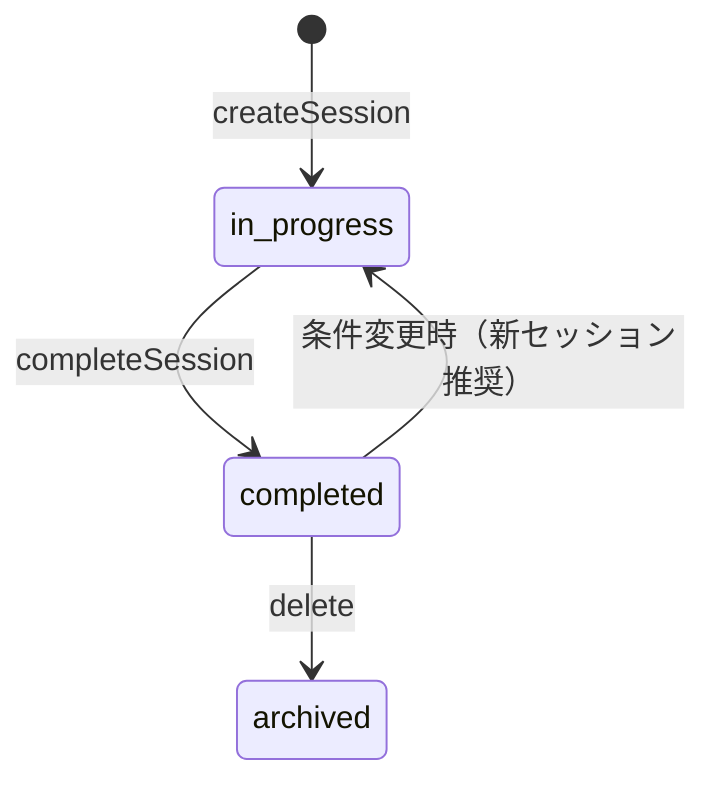

# プロジェクト用語集 (Glossary)

> **最終更新**: 2025-01-11  
> **対応ドキュメント**: PRD / 機能設計 / アーキテクチャ / リポジトリ構造

---

## 目次

1. [ドメイン用語](#1-ドメイン用語)
2. [技術用語](#2-技術用語)
3. [アーキテクチャ用語](#3-アーキテクチャ用語)
4. [ステータス・状態](#4-ステータス状態)
5. [略語・頭字語](#5-略語頭字語)

---

## 1. ドメイン用語

DX Selecta 固有のビジネス概念・機能に関する用語。

### 診断（Diagnosis）

| 項目 | 内容 |
|------|------|
| **定義** | ユーザーの会社属性・課題・制約・重み付けを入力し、SaaS推薦の基礎データを生成するプロセス |
| **説明** | 本プロダクトの入り口機能。対話形式で情報を収集し、後続の検索・推薦で使用 |
| **関連用語** | [DiagnosisSession](#diagnosissession), [DiagnosisInput](#diagnosisinput), [Must条件](#must条件) |
| **使用例** | 診断を完了すると、要件に合った候補SaaSが自動でランキング表示される |
| **対応PRD** | PRD: 1. 診断（要件入力） |

---

### DiagnosisSession

| 項目 | 内容 |
|------|------|
| **定義** | 1回の診断プロセスを管理するエンティティ。診断開始から完了までの状態を保持 |
| **説明** | ユーザーは複数のセッションを持てる（再検討・条件変更時） |
| **関連用語** | [診断](#診断diagnosis), [DiagnosisInput](#diagnosisinput) |
| **使用例** | 新しい診断セッションを作成し、前回とは異なる条件で検索する |
| **実装箇所** | `diagnosis_session` テーブル, `DiagnosisService` |

---

### DiagnosisInput

| 項目 | 内容 |
|------|------|
| **定義** | 診断セッション内でユーザーが入力した具体的な要件データ |
| **説明** | 会社属性、カテゴリ、課題、Must条件、重み付けを含む |
| **関連用語** | [DiagnosisSession](#diagnosissession), [Must条件](#must条件), [重み付け](#重み付けweights) |
| **使用例** | 診断入力に基づいてハイブリッド検索を実行する |
| **実装箇所** | `diagnosis_input` テーブル |

---

### Must条件

| 項目 | 内容 |
|------|------|
| **定義** | 推薦候補を絞り込む際の必須フィルタ条件（予算上限、言語、SSO、監査ログ等） |
| **説明** | Must条件を満たさないSaaSは検索結果から除外される（Hard Filter） |
| **関連用語** | [DiagnosisInput](#diagnosisinput), [Fact](#solutionfact) |
| **使用例** | Must条件で「SSO必須」を設定すると、SSO非対応の製品は候補から除外される |
| **対応PRD** | PRD: 1. 診断 - Must条件設定 |

---

### 重み付け（Weights）

| 項目 | 内容 |
|------|------|
| **定義** | 推薦スコアリング時の優先度調整値（運用負荷/導入難易度/連携/セキュリティ/価格） |
| **説明** | 0-10のスライダーで設定。スコア計算時に各軸の重要度として反映 |
| **関連用語** | [DiagnosisInput](#diagnosisinput), [スコアリング](#スコアリングscoring) |
| **使用例** | 「価格」の重みを高くすると、コストパフォーマンスの良いSaaSが上位に表示される |
| **実装箇所** | `DiagnosisWeights` 型 |

---

### 推薦（Recommendation）

| 項目 | 内容 |
|------|------|
| **定義** | 診断入力に基づいてSaaSをランキング表示する機能 |
| **説明** | Must条件フィルタ → ハイブリッド検索 → 重み付きスコアリング の3段階で候補を抽出 |
| **関連用語** | [ハイブリッド検索](#ハイブリッド検索), [スコアリング](#スコアリングscoring), [Explain](#explain) |
| **使用例** | 推薦結果から上位3件を選んで比較表を作成する |
| **対応PRD** | PRD: 2. 検索・推薦 |

---

### ハイブリッド検索

| 項目 | 内容 |
|------|------|
| **定義** | BM25（キーワード全文検索）とベクトル検索を組み合わせた検索手法 |
| **説明** | 正確なキーワードマッチとセマンティック類似度の両方を考慮して候補を抽出 |
| **関連用語** | [pgvector](#pgvector), [SolutionChunk](#solutionchunk), [Embedding](#embedding) |
| **使用例** | ハイブリッド検索により「経費精算」という入力から「経費管理ツール」も候補に含まれる |
| **実装箇所** | `SearchService.hybridSearch()`, Supabase Edge Functions |

---

### スコアリング（Scoring）

| 項目 | 内容 |
|------|------|
| **定義** | 各候補SaaSに対して総合評価スコアを算出するプロセス |
| **説明** | BM25スコア、ベクトル類似度、Factマッチ度を重み付きで合算 |
| **関連用語** | [重み付け](#重み付けweights), [ScoreBreakdown](#scorebreakdown) |
| **使用例** | スコアリング結果に基づいて上位5件を推薦候補として表示する |
| **実装箇所** | `services/search/scoringAlgorithm.ts` |

---

### Explain

| 項目 | 内容 |
|------|------|
| **定義** | 推薦理由を根拠URL・抜粋・最終確認日とともに提示する情報 |
| **説明** | 「なぜこのSaaSが推薦されたか」をユーザーが理解・検証できるようにする |
| **関連用語** | [SearchResult](#searchresult), [SolutionFact](#solutionfact), [SolutionChunk](#solutionchunk) |
| **使用例** | Explainを確認して、推薦根拠が自社要件と合致しているか検証する |
| **対応PRD** | PRD: 2. 検索・推薦 - Explain付与 |

---

### 比較マトリクス（Comparison Matrix）

| 項目 | 内容 |
|------|------|
| **定義** | 評価軸（行）× 候補SaaS（列）のマトリクス形式で情報を比較表示するUI |
| **説明** | 各セルに値と根拠URL、「要確認」フラグを表示 |
| **関連用語** | [ComparisonAxis](#comparisonaxis), [SearchResult](#searchresult) |
| **使用例** | 比較マトリクスをCSVエクスポートして社内共有する |
| **対応PRD** | PRD: 3. 比較UI |

---

### 稟議（Proposal）

| 項目 | 内容 |
|------|------|
| **定義** | SaaS導入承認を得るための社内提案ドキュメント |
| **説明** | 本プロダクトでは比較結果から自動生成。Markdown/Google Docs形式で出力 |
| **関連用語** | [ProposalOutput](#proposaloutput), [稟議テンプレート](#稟議テンプレート) |
| **使用例** | 稟議を再生成して、上司からの指摘事項を反映する |
| **対応PRD** | PRD: 4. 稟議1枚生成 |

---

### 稟議テンプレート

| 項目 | 内容 |
|------|------|
| **定義** | 稟議書の構成項目（背景/目的/比較/推奨理由/懸念/費用/導入ステップ/セキュリティ/質問リスト/承認依頼） |
| **説明** | テンプレートに沿って各項目が自動生成される |
| **関連用語** | [稟議](#稟議proposal), [ProposalOutput](#proposaloutput) |
| **使用例** | 稟議テンプレートに従って、差し戻しに強い提案書を作成する |
| **実装箇所** | `services/proposal/templateEngine.ts` |

---

### Solution

| 項目 | 内容 |
|------|------|
| **定義** | データベースに登録されたSaaS製品マスタ |
| **説明** | 製品名、ベンダー、カテゴリ、公式URL、ロゴ等の基本情報を保持 |
| **関連用語** | [SolutionFact](#solutionfact), [SolutionChunk](#solutionchunk) |
| **使用例** | Solutionマスタから会計カテゴリの製品を検索する |
| **実装箇所** | `solution` テーブル |

---

### SolutionFact

| 項目 | 内容 |
|------|------|
| **定義** | SaaS製品の構造化された属性情報（SSO対応、監査ログ、API、データ保管地域等） |
| **説明** | Must条件フィルタリングやExplain生成に使用。根拠URL・確信度付き |
| **関連用語** | [Solution](#solution), [Must条件](#must条件), [Explain](#explain) |
| **使用例** | SolutionFactの「SSO: supported」を根拠として推薦理由に表示する |
| **実装箇所** | `solution_fact` テーブル |

---

### SolutionChunk

| 項目 | 内容 |
|------|------|
| **定義** | SaaS製品ドキュメントを分割したテキストチャンクとそのEmbedding |
| **説明** | 価格ページ、機能ページ、セキュリティページ等から抽出。ベクトル検索に使用 |
| **関連用語** | [Solution](#solution), [Embedding](#embedding), [ハイブリッド検索](#ハイブリッド検索) |
| **使用例** | SolutionChunkからユーザーの課題に意味的に近い情報を検索する |
| **実装箇所** | `solution_chunk` テーブル（pgvector） |

---

### Tenant

| 項目 | 内容 |
|------|------|
| **定義** | 本サービスを利用する組織単位 |
| **説明** | テナントごとにプラン、検索スコープ、収集モードを設定可能 |
| **関連用語** | [TenantMember](#tenantmember), [search_scope](#search_scope), [ingestion_mode](#ingestion_mode) |
| **使用例** | 新しいテナントを作成し、チームメンバーを招待する |
| **実装箇所** | `tenant` テーブル |

---

### search_scope

| 項目 | 内容 |
|------|------|
| **定義** | 検索対象の地理的範囲設定（`JP_ONLY` / `JP_GLOBAL`） |
| **説明** | `JP_ONLY`: 国内SaaSのみ、`JP_GLOBAL`: 海外SaaSも含む |
| **関連用語** | [Tenant](#tenant) |
| **使用例** | search_scopeを`JP_GLOBAL`に変更して、海外ツールも候補に含める |
| **対応PRD** | PRD: 5. 認証・テナント管理 |

---

### ingestion_mode

| 項目 | 内容 |
|------|------|
| **定義** | SaaS情報の収集モード（`CURATED` / `BROAD`） |
| **説明** | `CURATED`: 厳選・検証済みデータ、`BROAD`: 広範囲収集（Post-MVP） |
| **関連用語** | [Tenant](#tenant) |
| **使用例** | ingestion_modeが`CURATED`の場合、検証済み製品のみが候補に表示される |

---

## 2. 技術用語

DX Selecta で使用している技術・フレームワーク・ツール。

### Supabase

| 項目 | 内容 |
|------|------|
| **定義** | PostgreSQL をベースとした BaaS（Backend as a Service） |
| **公式サイト** | https://supabase.com |
| **本プロジェクトでの用途** | 認証（Auth）、データベース（PostgreSQL）、ストレージ、Edge Functions |
| **バージョン** | Supabase JS v2.x |
| **実装箇所** | `src/lib/supabase/` |
| **関連ドキュメント** | [docs/architecture.md](architecture.md) |

---

### pgvector

| 項目 | 内容 |
|------|------|
| **定義** | PostgreSQL のベクトル検索拡張機能 |
| **公式サイト** | https://github.com/pgvector/pgvector |
| **本プロジェクトでの用途** | SolutionChunkのEmbedding保存・近傍検索（ハイブリッド検索のベクトル部分） |
| **関連用語** | [Embedding](#embedding), [ハイブリッド検索](#ハイブリッド検索), [SolutionChunk](#solutionchunk) |
| **実装箇所** | `solution_chunk.embedding` カラム（IVFFlat インデックス） |

---

### Embedding

| 項目 | 内容 |
|------|------|
| **定義** | テキストを数値ベクトル（1536次元）に変換したもの |
| **説明** | OpenAI API（text-embedding-ada-002等）で生成。意味的類似度計算に使用 |
| **関連用語** | [pgvector](#pgvector), [SolutionChunk](#solutionchunk), [OpenAI API](#openai-api) |
| **使用例** | ユーザーの課題文からEmbeddingを生成し、類似するSolutionChunkを検索する |
| **実装箇所** | `supabase/functions/generate-embedding/` |

---

### RLS（Row Level Security）

| 項目 | 内容 |
|------|------|
| **定義** | PostgreSQL の行レベルセキュリティ機能。テーブルの各行へのアクセスをポリシーで制御 |
| **本プロジェクトでの用途** | テナント分離。ユーザーは自テナントのデータのみアクセス可能 |
| **関連用語** | [Supabase](#supabase), [Tenant](#tenant) |
| **実装箇所** | Supabase Dashboard / マイグレーション |
| **参照** | [docs/architecture.md](architecture.md) - セキュリティ設計 |

---

### RSC（React Server Components）

| 項目 | 内容 |
|------|------|
| **定義** | サーバーサイドでレンダリングされるReactコンポーネント |
| **本プロジェクトでの用途** | `page.tsx` をRSCとして実装し、初期データフェッチをサーバーで実行 |
| **関連用語** | [Server Actions](#server-actions), [Next.js](#nextjs) |
| **実装箇所** | `src/app/` 配下の `page.tsx` |
| **参照** | [docs/architecture.md](architecture.md) - レイヤー設計 |

---

### Server Actions

| 項目 | 内容 |
|------|------|
| **定義** | Next.js のサーバーサイドミューテーション機能 |
| **本プロジェクトでの用途** | フォーム送信、データ作成・更新・削除の処理 |
| **関連用語** | [RSC](#rscreact-server-components), [Next.js](#nextjs) |
| **実装箇所** | `src/actions/` |
| **参照** | [docs/repository-structure.md](repository-structure.md) |

---

### Next.js

| 項目 | 内容 |
|------|------|
| **定義** | React ベースのフルスタックWebフレームワーク |
| **公式サイト** | https://nextjs.org |
| **本プロジェクトでの用途** | フロントエンド + APIレイヤー。App Router使用 |
| **バージョン** | 15.x |
| **関連用語** | [RSC](#rscreact-server-components), [Server Actions](#server-actions) |

---

### OpenAI API

| 項目 | 内容 |
|------|------|
| **定義** | OpenAI社が提供するAI API（GPT、Embeddings等） |
| **公式サイト** | https://platform.openai.com |
| **本プロジェクトでの用途** | Embedding生成、稟議テキスト生成 |
| **実装箇所** | `src/lib/openai/`, `supabase/functions/` |

---

### Google Docs API

| 項目 | 内容 |
|------|------|
| **定義** | Google Docs を操作するAPI |
| **本プロジェクトでの用途** | 稟議書をGoogle Docs形式でエクスポート |
| **実装箇所** | `src/lib/google/docs.ts` |
| **対応PRD** | PRD: 4. 稟議1枚生成 - Google Docs出力 |

---

### Zod

| 項目 | 内容 |
|------|------|
| **定義** | TypeScript ファーストのスキーマバリデーションライブラリ |
| **公式サイト** | https://zod.dev |
| **本プロジェクトでの用途** | Server Actions入口でのバリデーション、フォーム検証 |
| **実装箇所** | `src/services/*/validation.ts` |

---

## 3. アーキテクチャ用語

システム設計・構成に関する用語。

### Service Layer

| 項目 | 内容 |
|------|------|
| **定義** | ビジネスロジックを実装するレイヤー。UIに依存せず、Repositoryを通じてデータアクセス |
| **本プロジェクトでの適用** | `src/services/` 配下に配置。各ドメインごとにServiceを作成 |
| **関連コンポーネント** | DiagnosisService, SearchService, CompareService, ProposalService |
| **関連用語** | [Repository Layer](#repository-layer) |
| **参照** | [docs/architecture.md](architecture.md), [docs/repository-structure.md](repository-structure.md) |

---

### Repository Layer

| 項目 | 内容 |
|------|------|
| **定義** | データアクセスを抽象化するレイヤー。Supabase操作をカプセル化 |
| **本プロジェクトでの適用** | `src/repositories/` 配下に配置。エンティティごとにRepositoryを作成 |
| **関連コンポーネント** | UserRepository, DiagnosisRepository, SolutionRepository |
| **関連用語** | [Service Layer](#service-layer) |
| **参照** | [docs/repository-structure.md](repository-structure.md) |

---

### Edge Functions

| 項目 | 内容 |
|------|------|
| **定義** | Supabase が提供するサーバーレス関数（Deno Runtime） |
| **本プロジェクトでの適用** | ハイブリッド検索、Embedding生成など重い処理をDB近くで実行 |
| **関連用語** | [Supabase](#supabase), [ハイブリッド検索](#ハイブリッド検索) |
| **実装箇所** | `supabase/functions/` |

---

### ルートグループ（Route Group）

| 項目 | 内容 |
|------|------|
| **定義** | Next.js App Router の機能。`(groupName)` でURLに影響せずルートを整理 |
| **本プロジェクトでの適用** | `(auth)`: 認証系、`(dashboard)`: 認証後メインアプリ |
| **関連用語** | [Next.js](#nextjs) |
| **実装箇所** | `src/app/(auth)/`, `src/app/(dashboard)/` |

---

## 4. ステータス・状態

システム内で使用される状態値の定義。

### DiagnosisSessionのステータス

| ステータス | 値 | 意味 | 遷移条件 | 次の状態 |
|----------|-----|------|---------|---------|
| 進行中 | `in_progress` | 診断入力中 | セッション作成時 | `completed` |
| 完了 | `completed` | 診断完了、検索可能 | 入力保存完了時 | `archived` |
| アーカイブ | `archived` | 論理削除済み | ユーザーが削除 | - |

**状態遷移図**:

**実装箇所**: `diagnosis_session.status`, `DiagnosisSession.status`

---

### ProposalOutputのformat

| 値 | 意味 |
|-----|------|
| `markdown` | Markdown形式で保存・表示 |
| `google_docs` | Google Docs形式でエクスポート済み |

---

### Tenantのplan

| 値 | 意味 | 機能制限 |
|-----|------|---------|
| `free` | 無料プラン | 上位3件表示、簡易比較のみ |
| `business` | ビジネスプラン | 稟議生成、Docs出力、履歴、共有 |
| `enterprise` | エンタープライズ | SSO、監査ログ、カスタムテンプレート |

---

### SolutionFactのconfidence

| 値 | 意味 |
|-----|------|
| `high` | 公式サイトで確認済み |
| `medium` | 二次情報源で確認 |
| `low` | 未確認・推測 |

---

## 5. 略語・頭字語

### 一般略語

| 略語 | 展開 | 説明 |
|------|------|------|
| PRD | Product Requirements Document | プロダクト要求定義書 |
| KPI | Key Performance Indicator | 重要業績評価指標 |
| DAU | Daily Active Users | 日次アクティブユーザー数 |
| SaaS | Software as a Service | クラウド型ソフトウェア |
| BaaS | Backend as a Service | バックエンド・アズ・ア・サービス |
| SSO | Single Sign-On | シングルサインオン |
| RLS | Row Level Security | 行レベルセキュリティ |
| RSC | React Server Components | Reactサーバーコンポーネント |
| API | Application Programming Interface | アプリケーション・プログラミング・インターフェース |
| JWT | JSON Web Token | JSON形式の認証トークン |
| RFP | Request for Proposal | 提案依頼書 |
| PoC | Proof of Concept | 概念実証 |

### プロジェクト固有略語

| 略語 | 展開 | 説明 |
|------|------|------|
| DX Selecta | - | 本プロダクト名 |
| SC | SolutionChunk | ドキュメントチャンク（内部用語） |
| SF | SolutionFact | 製品ファクト情報（内部用語） |

---

## 変更履歴

| 日付 | 変更内容 | 理由 |
|------|---------|------|
| 2025-01-11 | 初版作成 | PRD/機能設計/アーキテクチャ v1.0 対応 |

